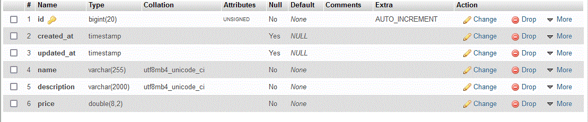

# Laravel-Project


# A) Technologies Used:


<b>

1. php
2. Laravel
3. Eloquent
4. Migrations
5. Pagination
6. Validation
7. API
8. Authentication
9. HTML
10. JavaScript


</b>


# B) How to Run:

```bash
php artisan serve
```


# C) Backend:


## C-1) Models:


### C-1-1) User Model:

The user model is already built in with laravel.


### C-1-2) Products Model:





The products model has these fields:


<table>
	<tr>
		<th>Index</th>
		<th>Field Name</th>
		<th>Type</th>
		<th>Nullable</th>
		<th>Default value</th>
	</tr>
	<tr>
		<td>1</td>
		<td>id</td>
		<td>id (Primary Key)</td>
		<td>False</td>
		<td>Auto Increment</td>
	</tr>
	<tr>
		<td>2</td>
		<td>created_at</td>
		<td>datetime</td>
		<td>True</td>
		<td>Auto Generated by laravel (The moment of the creation of the record)</td>
	</tr>
	<tr>
		<td>3</td>
		<td>updated_at</td>
		<td>datetime</td>
		<td>True</td>
		<td>Auto Generated by laravel (The moment of the modifying record)</td>
	</tr>
	<tr>
		<td>4</td>
		<td>name</td>
		<td>string</td>
		<td>False</td>
		<td>-</td>
	</tr>
	<tr>
		<td>5</td>
		<td>description</td>
		<td>string</td>
		<td>False</td>
		<td>-</td>
	</tr>
	<tr>
		<td>6</td>
		<td>price</td>
		<td>float</td>
		<td>False</td>
		<td>-</td>
	</tr>


</table>


